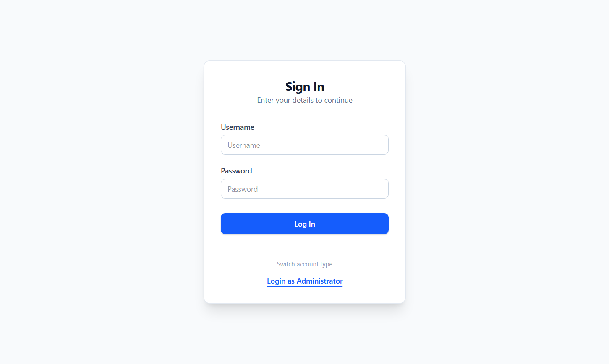
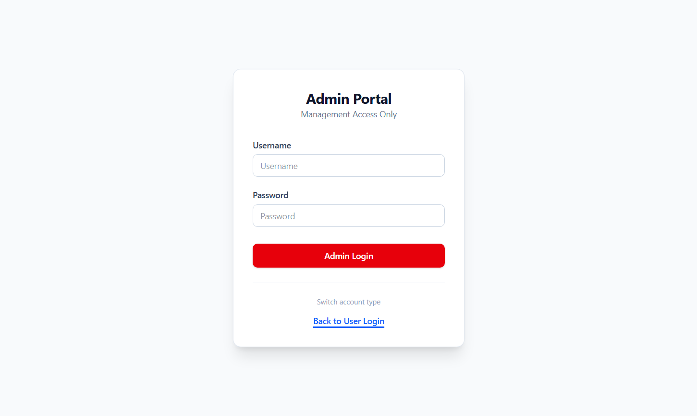
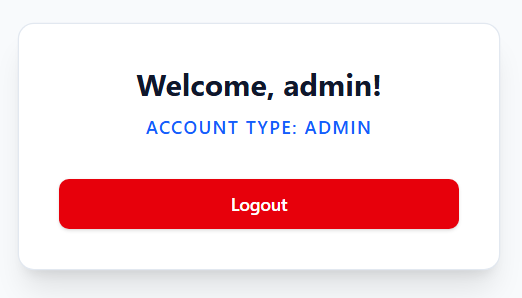

# Full-Stack User & Admin Authentication System

A lightweight and secure authentication system built with **React (Vite)**, **Tailwind CSS**, and **Express.js**.  
This project demonstrates **role-based access control**, **protected routing**, and **client-side session persistence** using `localStorage`.

---

## Tech Stack

### Frontend
- React (Vite)
- Tailwind CSS
- Axios
- React Router DOM

### Backend
- Node.js
- Express.js
- CORS


#### Admin Login
```
username: admin
password: password123
```

### Session Management
- LocalStorage (Client-side session persistence)

---

## Installation & Setup

Follow the steps below to run the project locally.

---

### 1️⃣ Clone the Repository

```bash
git clone <your-repository-url>
cd project
```

---

## Backend Setup (Express)

Navigate to the backend folder:

```bash
cd expressproject
```

Install dependencies:

```bash
npm install
```

Start the development server:

```bash
npm run dev
```

The backend server will run at:

```
http://localhost:5000
```

---

##  Frontend Setup (React + Vite)

Open a new terminal and navigate to the frontend folder:

```bash
cd reactproject
```

Install dependencies:

```bash
npm install
```

Start the development server:

```bash
npm run dev
```

The frontend application will run at:

```
http://localhost:5173
```

---

# Application Flow

## 1️⃣ Login Authentication

- A **single dynamic form** handles both **User** and **Admin** login.
- Use the **"Switch Account Type"** toggle to change roles.
- The UI updates dynamically:
  - 🔵 Blue theme → User
  - 🔴 Red theme → Admin

📸 Screenshot:

```markdown

```

```markdown

```

---

## 2️⃣ Session Persistence

After successful login:

1. The server returns authenticated user data.
2. The frontend stores the data in `localStorage` under the key:

```js
'user'
```

3. The user is redirected to the **Success** page.

---

## 3️⃣ Protected Success Page

- The `/success` route is protected.
- If a user tries to access `/success` without authentication:
  - They are automatically redirected to the Login page.
- Displays:
  - Personalized greeting
  - Role-based badge (User/Admin)

📸 Screenshot:

```markdown

```

```markdown

```

---

## 4️⃣ Logout Functionality

- Clicking **Logout**:
  - Removes the `user` key from `localStorage`
  - Redirects the user back to the Login page
- The Success page becomes inaccessible until re-authentication.

---

# 📂 Project Structure

```
project/
├── expressproject/        # Backend API
│   ├── index.js           # Express server & login routes
│   └── package.json
│
└── reactproject/          # Frontend UI
    ├── src/
    │   ├── components/    # LoginForm.jsx & Success.jsx
    │   ├── App.jsx        # Routing & Protected Route logic
    │   └── main.jsx
    └── package.json
```

---

# ⚠️ Important Notes

### ✅ CORS Configuration

Ensure `cors()` is enabled in your Express backend to allow requests from the Vite development server.

Example:

```js
const cors = require('cors');
app.use(cors());
```

---

### ⚠️ Port Conflicts

If port `5000` is already in use:

1. Change the `PORT` value in:
   ```
   expressproject/index.js
   ```
2. Update the Axios base URL in:
   ```
   reactproject/src/components/LoginForm.jsx
   ```

---

# Features Overview

- ✔ Role-based authentication (User & Admin)
- ✔ Dynamic UI theme switching
- ✔ Protected routes
- ✔ Session persistence with localStorage
- ✔ Logout with automatic redirect
- ✔ Clean and responsive UI

---

